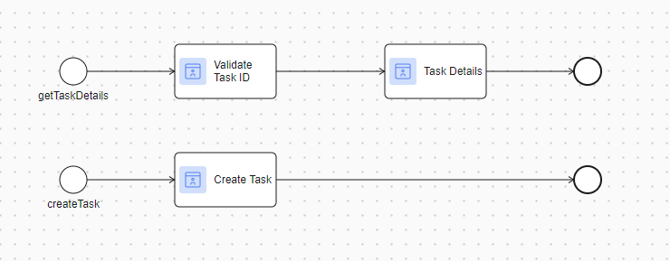

# Asana Connector

[Asana](https://asana.com/) is a web and mobile application designed for team collaboration and project management.
It allows users to organize tasks, track progress, assign work, set deadlines, and communicate within teams, making project and workflow management efficient.
This connector provides the following capabilities:
- Create a task.
- Get task details.
- Update task details.
- Delete task.

## Demo

Check out the demo implementations we have prepared for the Asana connector:

.

This demo provides the following features:
1. Create Task
- Creates a new task with sample data (e.g., task name, workspace, project, assignee, start date and due date).
- `Project` and `Assignee` will be fetched base on the selected `Workspace`.
- If the provided `Personal Access Token (PAT)` is invalid, the `Workspace` data will be empty. 
.
2. Task List
- Shows a table of tasks base on selected `Workspace` and `Project`
- Two actions can be performed in the `Actions` column: `Delete` and `Update`.
- Clicking `Update` will navigate user to the `Update` page.
.
3. Update Task
- Allows editing task details such as the task name, assignee, start date, and due date.
.

## Setup

In order to use this product you must configure the variables.

Add the following code block to your `config/variables.yaml` file of your main Business Project that will utilize this product:

```
@variables.yaml@
```

### Asana Registration

1. Register for an Asana account on the [Asana Dashboard](https://asana.com/)
1. Once logged in, [Create a PAT](https://app.asana.com/0/my-apps)
(Personal access token), which you will later add to the `variables.yaml`.
    .
1. Refer to the [Quick start guide](https://developers.asana.com/docs/quick-start) to learn how to access your Workspace GID.
>>>>>>> Stashed changes
