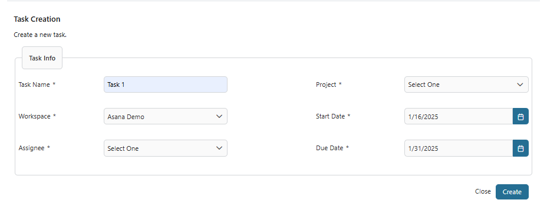
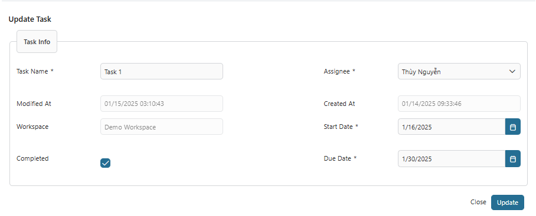
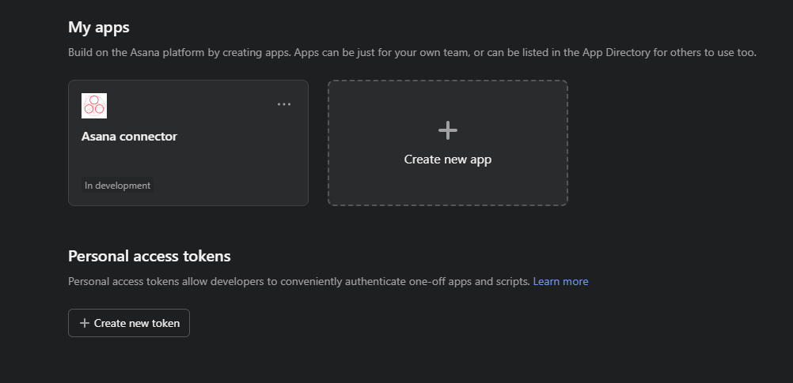

# Asana Anschluss

[Asana](https://asana.com/) ist ein Web und mobiler Antrag gestaltet für
Mannschaft Kollaboration und Projekt Management. Es hilft Mannschaften
organisieren Tasks, Fährte Fortgang, weis zu Arbeit, Apparat Abgabeschlüsse, und
kommunizieren genügend.

Der #Axon Efeu Asana Anschluss versieht die folgenden Fähigkeiten:
- Schaff einen Task
- #Wiedergewinnen Task Details
- Update Task Details
- Streich einen Task

## Demo

Check aus die Demo Ausführungen wir vorbereitet haben für die Asana Anschluss:

.

Diese Demo versieht die folgenden Charakterzüge:

1. #Schaffen #Beschäftigen
- Schafft einen neuen Task mit Sample #Daten (#z.B., Task Name, Arbeitsraum,
  Projekt, assignee, Start Datum und fälliges Datum).
- `Projekt` und `Assignee` will sein geholt weiter Basis das exklusives
  `Arbeitsraum`.
- Ob das #versehen `Persönliche Zugang Automatenmünze (TÄTSCHEL)` ist Kranker,
  der `Arbeitsraum` #Daten will sein leer.
  .
2. #Beschäftigen #Listen
- Zeigt einen Tisch Tasks gründet weiter ausgewählt `Arbeitsraum` und `Projekt`
- Zwei Aktionen können sein aufgeführt herein die `Aktionen` Spalte: `Streichen`
  und `Update`.
- Klickend `Update` will befahren Nutzer zu den `Update` Seite.
  .
3. #Verbessern #Beschäftigen
- Erlaubt bearbeiten Task Details wie den Task Namen, assignee, Start Datum, und
  fälliges Datum. .

## Setup

#Um zu benutzen dieses Produkt du musst die Variablen konfigurieren.

Füg zu den folgenden Code Block zu eure `config/Variablen.yaml` Datei von eurem
hauptsächlichen Geschäft Projekt will jener nutzen dieses Produkt:

```
@variables.yaml@
```

### Asana Eintragung

1. Register für ein Asana Konto weiter das [Asana
   Armaturenbrett](https://asana.com/)
1. Einmal #loggen herein, [Schaffen ein
   TÄTSCHEL](https://app.asana.com/0/my-apps) (Persönliche Zugang
   Automatenmünze), #welche du willst nachher zufügen zu die `Variablen.yaml`.
   
1. Übergib zu das [Flotten Start
   Fremdenführer](https://developers.asana.com/docs/quick-start) zu lernen wie
   eure Arbeitsraum zu zugreifen GID.
